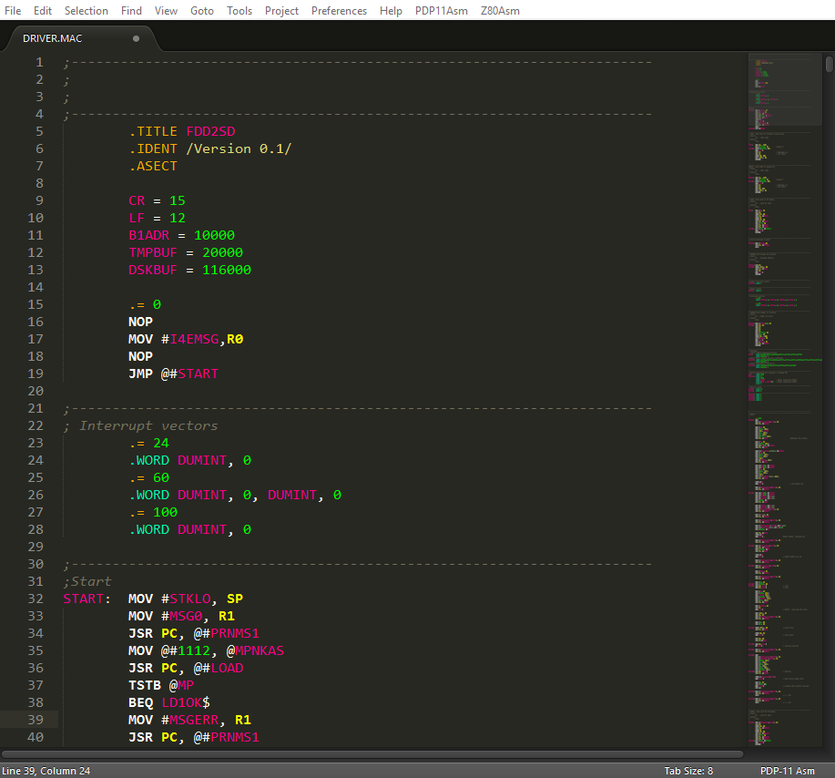

# [PDP-11 Asm plugin for Sublime Text 2/3](https://github.com/vwarlock/sublime-text-pdp11asm)
---

## Product Info

This plugin contains syntax definition for PDP-11 assembler language, code snippets, its own shiny color theme. Building system is mainly oriented on [macro11](https://github.com/shattered/macro11) assembler and [RT-11](http://zx-pk.ru/threads/24755-emulyator-rt-11.html) emulator. But of course you can use your own tools with a little fixes to configs.

---

## Installation and configuration

1. Copy the `pdp11asm` directory to the Sublime Text `Packages` directory. Installation is complete.
2. (Optional, see below) Go to the `PDP11Asm > Settings > Build script...` menu and specify a path to your macro11 binary. You also can add your own arguments to macro11.
3. (Optional, see below) Go to the `PDP11Asm > Settings > Emul script...` menu and specify a path to your rt11 binary. You also can modify the way the emulator starts.
4. Go to the `Tools > Build System` menu and select the `PDP11Asm` item.

---

## Features

#### Color scheme

This plugin contains its own color scheme `pdp11asm.tmTheme` based on Monokai theme. There are some `*.asm` scope selectors with specific colors for assembler tokens. You can tune it on your own taste or integrate it into any other theme. If you don't want any special theme for PDP-11 Asm - go to the `PDP11Asm > Settings > Main settings...` menu and comment the `"color_scheme": "Packages/pdp11asm/pdp11asm.tmTheme",` line out.

#### Build system

Sublime Text build system is defined in the `pdp11asm.sublime-build` file (`PDP11Asm > Settings > Build settings...`). This definition file will run an appropriate script for Windows/Linux/OSX system. It also defines `Run` and `Build and Run` actions.

You can specify a path to assembler by `PDP11Asm > Settings > Build script...` menu. The included script (`PDP11Asm > Settings > Build script...`) performs a search for a `make.bat`/`make.sh` script in the project folder. If the script is found, it will be called (in this case you don't have to specify a path to assembler), otherwise assembler will run against the current file. Included script also removes the `.obj` file which is often redundant. If you need this file - comment out the removal.

#### Emulator support

You can specify a path to emulator by `PDP11Asm > Settings > Emul script...` menu. The included script attempts to do a search for an `emul.bat`/`emul.sh` script in the project folder. If the script is found, it will be called (in this case you don't have to specify a path to emulator), otherwise the emulator will run with `%asm_name%.sav` parameter. So, to make things work, you must put the `emul.bat` or `emul.sh` script into the project folder, or your source file must create .sav with the same base name (hello.mac -> hello.sav).

#### Snippets

There are a lot of useful snippets ('<CTRL>+<F1>'), you can trigger them by typing their name and pressing Tab:

	* ---            - Delimiter
	* !init          - Skeleton for assembler
	* !rt11prog      - Simple RT-11 programm skeleton

#### Auto completion and Goto Symbol

This plugin expands the auto completion feature to all opened tabs (instead of just current file). You can disable it in the settings (`PDP11Asm > Settings > Main settings...`).

You can use `Goto > Goto Symbol...` option to jump to the label definition. In Sublime Text 3 you also can use `Goto > Goto Symbol in Project...` to navigate through labels in the whole project.

#### Help files

In the `PDP1Asm > Help` sub-menu you can find a few help files. Some of them are provided with the plugin, and you also can put your help file into `Packages/pdp11asm/helps/`, and it will appear in menu. There are maximum 10 files allowed.

Also, you can call a quick help panel by pressing F1 where you can do a search through opcodes/mnemonics.

---

## Support

If you have a bug/feature request - please post it on [issue tracker](https://github.com/vwarlock/sublime-text-z80asm/issues).

---

## Thanks

---

## Copyright and license

(c) 2017, VWarlock.

Software is distributed on an "AS IS" BASIS, WITHOUT WARRANTIES OR CONDITIONS OF ANY KIND, either express or implied.
